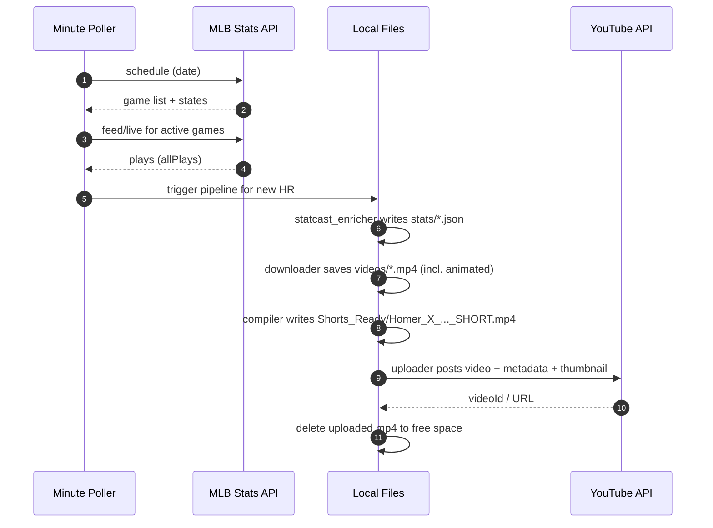

# HomerTrakker

A fully automated MLB home run pipeline that detects live HRs, downloads highlights (including animated replays), compiles vertical YouTube Shorts, uploads with Statcast-rich metadata, and cleans up local files.

Location
- /Users/benbirkhahn/HomerTrakker

Key scripts
- homer_minute_poller.py
  - Runs every minute via cron; only executes the pipeline when MLB games are live (or in a buffered window)
- statcast_enricher.py
  - Adds Statcast (EV, LA, Distance) per HR into JSON alongside post files
- download_homer_videos.py
  - Downloads broadcast angles and animated replays
- shorts_video_compiler.py
  - Converts to 9:16, concatenates angles, caps length to <= 59s
  - Requires both broadcast (4000K) and animated clips when HOMER_REQUIRE_BOTH=1
- youtube_homer_bot.py
  - Uploads Shorts with titles/descriptions/hashtags; sets custom thumbnail when allowed; deletes local video after upload

Data folders
- MLB_HomeRun_Posts/YYYY-MM-DD
  - tonights_homer_X_*.txt (post files)
  - stats/homer_X.json (Statcast)
  - videos/ (source clips)
- Shorts_Ready/ (compiled Shorts; removed after successful upload)
- Thumbnails_Ready/ (generated thumbnails)

Daily automation
- Cron (installed):
  - Every minute: runs homer_minute_poller.py
  - 03:30 nightly: removes Shorts_Ready/*.mp4 older than 7 days and temp dirs

Flow overview (Mermaid)
```mermaid
flowchart TD
    subgraph Scheduler
      C[cron: every minute] --> P[homer_minute_poller.py]
    end

    P -->|Refresh schedule (cache)| S[(MLB schedule cache)]
    P -->|If live window| Q[Run Pipeline]

    subgraph Pipeline
      E[statcast_enricher.py] --> D[download_homer_videos.py\n(broadcast + animated)]
      D --> V[shorts_video_compiler.py\n(9:16, <=59s, multi-angle)]
      V --> U[youtube_homer_bot.py\n(title/desc/hashtags, thumbnail)]
      U --> X[Cleanup local video]
    end

    Q --> E
```

HR event processing (sequence)


Title / description / hashtags
- Title: {Player} HR — Distance {FT} | Launch Angle {°} | Exit Velocity {MPH} #Shorts
- Description (2 lines + tags):
  - Statcast: {FT} • {° LA} • {MPH EV}
  - Matchup: {Away @ Home} — {Inning} • vs {Pitcher}
  - #MLB #HomeRun #MLBShorts #Statcast #{Player} #{AwayTeam} #{HomeTeam} #{FT}FT #{MPH}MPH

Upload settings
- Not made for kids (selfDeclaredMadeForKids=False)
- Custom thumbnail set from the video at 1s with overlayed stats (if channel is eligible)
- After successful upload, the local SHORT.mp4 is deleted

Manual commands
```bash
# activate
source ~/twitter_bot_env/bin/activate

# run complete daily flow manually for a date
date=2025-09-18
python3 statcast_enricher.py $date
python3 download_homer_videos.py $date
python3 shorts_video_compiler.py $date
python3 youtube_homer_bot.py $date   # choose 1 to upload all

# switch YouTube account (re-auth)
./switch_youtube_account.sh

# reinstall cron
./install_homer_cron.sh
```

State & logs
- Seen HR state: ~/.homer/state.json (small JSON cache)
- Cron logs: use macOS Console or redirect cron to a logfile if desired

Customization
- Buffers: poller uses 10 min pre and 6 h post windows; adjust in homer_minute_poller.py
- Poll cadence: driven by cron (every minute); can use launchd for more control
- Cleanup policy: 7-day retention for compiled Shorts; adjust in install_homer_cron.sh

Troubleshooting
- OAuth “developer/test user” error: add your channel’s Google account on the OAuth consent screen, External + Testing, scope youtube.upload
- Localhost blocked: we use fixed port 8080; keep terminal running during auth and use the latest link on the same machine
- YouTube upload limits: new channels often have daily caps; re-run tomorrow; the poller will continue automatically

---

## Automation & Operations (2025 refresh)

End-to-end behavior when a home run occurs
- Detect: Poller creates a post file (tonights_homer_*.txt) when an HR is seen during live games or within the time buffer.
- Enrich: Writes stats/homer_X.json with Statcast details (distance, launch angle, exit velocity).
- Download: Saves exactly one broadcast (preferring 4000K) and one animated replay if available.
- Compile: Builds a vertical Short with blurred background and concatenates angles.
  - Duration caps: 15s broadcast, 30s total (configurable via env vars below).
  - Default automation requires both angles present (broadcast + animated) before compiling (HOMER_REQUIRE_BOTH=1).
- Upload: Posts to YouTube with metadata; enforces upload-once via ~/.homer/uploads.json.
- Notify: iMessage to your number upon detection and after upload (with the YouTube link).
- Cleanup: Source videos removed after upload to save disk space.

Background poller (recommended runtime)
- Start (background, with alerts and auto-upload):
  - nohup /bin/zsh -lc 'export HOMER_PAUSE=0 HOMER_AUTO_UPLOAD=1 HOMER_BROADCAST_MAX_SECS=15 HOMER_TOTAL_MAX_SECS=30 HOMER_NOTIFY_PHONE=+19144142424 HOMER_REQUIRE_BOTH=1; while true; do ~/twitter_bot_env/bin/python3 ~/HomerTrakker/homer_minute_poller.py || true; sleep 60; done' > ~/HomerTrakker/logs/homer_poller.log 2>&1 & echo $!
- Monitor logs:
  - tail -f ~/HomerTrakker/logs/homer_poller.log
- Stop:
  - pkill -f "HomerTrakker/homer_minute_poller.py"
- Pause/resume without stopping:
  - touch /tmp/homer_pause  # pause
  - rm -f /tmp/homer_pause  # resume

Environment variables
- HOMER_AUTO_UPLOAD=1
  - Enables automatic YouTube uploads (non-interactive).
- HOMER_BROADCAST_MAX_SECS=15
  - Max seconds for the first (broadcast) segment.
- HOMER_TOTAL_MAX_SECS=30
  - Total cap for concatenated segments (keeps Shorts under 60s once re-encoded).
- HOMER_REQUIRE_BOTH=1
  - Require both angles (broadcast + animated) to compile/upload; unset or set to 0 to allow single-angle manual compiles.
- HOMER_NOTIFY_PHONE=+19144142424
  - E.164 phone number for iMessage notifications (iMessage must be enabled on the Mac).
- HOMER_ALLOW_PRODUCED=1
  - Optional: allow producedclips as a fallback when no diamond/darkroom clips exist.
- HOMER_PAUSE=1
  - Optional global pause; poller exits early if set.

Notifications (iMessage)
- On detection (post creation):
  - Message includes batter vs pitcher, inning, play description, and available Statcast numbers (FT | ° | MPH).
- After upload:
  - Message includes the final YouTube link.
- Implementation details:
  - Uses AppleScript (osascript) via Messages app; macOS may prompt to allow Terminal/automation once.

Upload-once ledger
- Path: ~/.homer/uploads.json
- Prevents accidental duplicate uploads; when re-uploading a specific homer, delete the date:homer key first.

Manual one-off reprocess (per homer)
- Steps (example for homer #4 on 2025-09-20):
  1) Restore post file into MLB_HomeRun_Posts/DATE if archived.
  2) Download with policy (4000K + animated): python3 download_homer_videos.py DATE
  3) Compile: HOMER_REQUIRE_BOTH=1 HOMER_BROADCAST_MAX_SECS=15 HOMER_TOTAL_MAX_SECS=30 python3 shorts_video_compiler.py DATE
  4) Clear ledger key DATE:NUM in ~/.homer/uploads.json
  5) Upload only that homer (non-interactive):
     - python3 -c 'from youtube_homer_bot import YouTubeHomeRunBot as B; b=B(); b.upload_homer_video(4, "2025-09-20")'
  6) Cleanup: remove MLB_HomeRun_Posts/DATE/videos; archive the post file.

Notes
- Keep the Mac awake during games to avoid missed detections. Example: caffeinate -dimsu
- First YouTube auth opens a browser window; approve access and the token is saved to youtube_token.json.
- If Messages automation fails, open Messages once and accept any macOS automation prompts, then retry.
